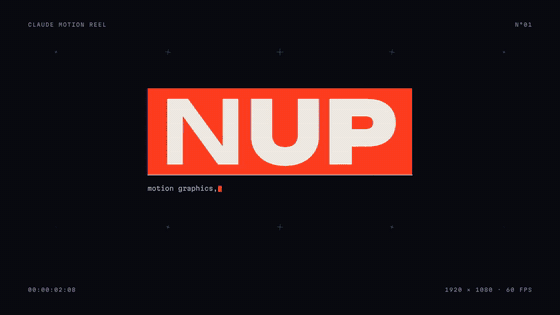
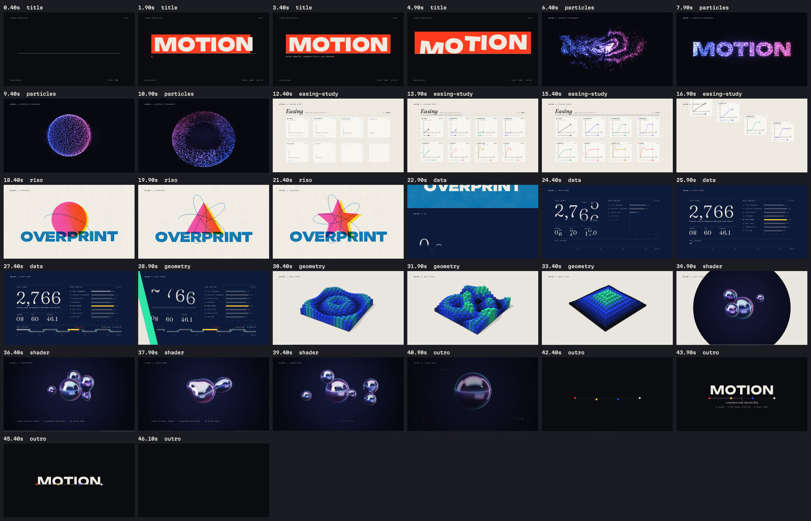

# Claude Motion Reel

[](https://github.com/John-issa/claude-motion-graphics/actions/workflows/ci.yml)

A motion graphics showreel that renders live in the browser, frame by frame, from
a small motion engine written for it. The player uses no video files, no audio
files and no animation libraries: every frame is computed on demand from the
current time, and the soundtrack is synthesized from the same timeline. You can
scrub, step frame by frame, type your own title into it, and export it to video.



**[Watch the full reel with sound](media/claude-motion-reel.mp4)** (45 s, 1280 × 720, MP4 with the procedural soundtrack, rendered by `npm run render`).

## Try it

```bash
npm install
npm run dev          # then open http://127.0.0.1:5173
```

Or build the single-file version and open it straight from disk:

```bash
npm run build        # writes dist/index.html (fonts, CSS and JS all inlined)
open dist/index.html
```

| Key | Action |
| --- | --- |
| Space / K | Play or pause |
| J / L | Back / forward one second |
| ← / → | One frame (Shift: one second) |
| Home / End | Start / end |
| 1 – 8 | Jump to a scene |
| S | Sound |
| G | Safe-area guides |
| B | Motion blur |
| F | Fullscreen |

Type into **Title** to put your own words into the title card, the particle scene
and the end card (it starts as NUP). **Shuffle** changes the seed behind every
generative element. **Sound** plays the soundtrack (browsers only allow audio
after a click, so it starts off). **Record WebM** plays the reel once and saves
it, with sound if it's on.

To share the reel with a title already set, add it to the link after a `#`,
with underscores for spaces: `…/index.html#HELLO_WORLD` opens it as HELLO WORLD.

## The scenes



<!-- scenes:start -->
| # | Scene | Length | Techniques |
| --- | --- | --- | --- |
| 01 | Title Sequence | 6.0 s | Per-glyph layout that keeps kerning · Closed-form spring physics · Variable font weight animation · Mask reveals · SMPTE timecode from the frame counter |
| 02 | Particle Typography | 7.0 s | 6,300 particles in closed form · Curl-noise flow field · Text sampled into a point cloud · 3D sphere and torus in perspective · Additive light, splatted in one pass |
| 03 | Easing Study | 6.5 s | Penner easing family · Damped spring in closed form · One clock drives every panel · Spacing charts from eased values · Each card exits on its curve, reversed |
| 04 | Risograph | 6.0 s | Multiply overprint · Procedural halftone · Outline morphing with resampled polygons · Misregistration on twos |
| 05 | Data Story | 6.3 s | Every number read from the reel's own timeline · Odometer digits in fixed-width cells · Staggered bar growth with measured labels · Live playhead at the true global time |
| 06 | Wave Field | 6.5 s | Perspective projection from scratch · Painter's-algorithm depth sort · Flat shading, three light facets · Two-source wave interference |
| 07 | Liquid Metal | 7.0 s | Raymarched signed distance fields · Smooth-minimum blending · Thin-film iridescence · Analytic inter-reflections · WebGL composited into the 2D frame |
| 08 | End Card | 5.5 s | Motion paths with Bézier handles · Spring-settled lockup · Credits computed from the reel timeline · Seamless loop into the title |

Total running time 45.4 s (2,724 frames at 60 fps), with scenes overlapping during transitions.
<!-- scenes:end -->

## How it works

**Every frame is a pure function of time.** A scene is a module with a
`render(ctx, s)` function that draws the instant `s.t` into a 1920 × 1080 design
space. Scenes never keep state between frames and never call `Math.random`, so
the player can jump anywhere, play backwards or render the same instant twice
and get the same pixels. That one rule is what makes everything else here work:

- **Scrubbing and frame stepping** are just rendering a different `t`.
- **Motion blur** is real temporal supersampling: the reel renders several
  sub-frames across a 180° shutter and averages them.
- **Export** is exact: `npm run render` steps through every frame in headless
  Chromium and pipes them to ffmpeg, with no dropped or duplicated frames.
- **Sound follows the same timeline.** `score.js` composes a score from the
  scenes and their transitions: a chord pad per scene that crossfades through
  each transition, a whoosh landing on every cut, and hits on each scene's own
  visual beats, which scenes declare with `cues()`. The player plays it live,
  with the audio clock leading so picture and sound can't drift; the exporter
  renders it offline into the MP4.

The engine (`src/engine/`) is small and dependency-free:

| Module | What it does |
| --- | --- |
| `easing.js` | The full Penner set, a CSS-compatible cubic-Bézier solver (Newton–Raphson with a bisection fallback), and damped springs solved in closed form |
| `anim.js` | Keyframes, eased segments, staggering, a deterministic `wiggle()` |
| `noise.js`, `random.js` | Seeded simplex noise, curl noise, fractal noise, hashing and PRNGs |
| `text.js` | Canvas typography: per-glyph layout that keeps kerning, fitting, line balancing, sampling text into point clouds |
| `shapes.js` | Outline generation, resampling, morphing and partial-stroke drawing |
| `gl.js` | A shared WebGL layer for full-screen fragment shaders, composited into the 2D frame |
| `reel.js` | The timeline: places scenes, overlaps them, composites seven transition types, adds grain, vignette, chapter slugs and motion blur |
| `score.js` | The soundtrack, composed from the timeline and each scene's cues |
| `audio.js` | Web Audio synthesis (pads, FM bells, plucks, kicks, noise whooshes, impacts) into a reverb and compressor bus; live scheduling and offline rendering |

Scenes live in `src/scenes/`, one module each. [SCENES.md](SCENES.md) is the
contract for writing a new one.

## Rendering video

Needs ffmpeg on your `PATH` (or `FFMPEG_PATH`), plus Playwright's Chromium
(`npx playwright install chromium`).

```bash
npm run render                                   # media/claude-motion-reel.mp4, 1920×1080 at 60 fps
npm run render -- --width 1280 --fps 30          # smaller and faster
npm run render -- --motion-blur 8                # 8 sub-frames per frame
npm run render -- --params '{"title":"HELLO"}'   # your own title
npm run render -- --gif media/preview.gif        # also write a GIF
npm run render -- --no-audio                     # leave out the soundtrack
```

The soundtrack is rendered offline from the same score the player uses and
muxed in as AAC.

## Checking the work

```bash
npm test                                          # engine unit tests and the scene contract
npm run check                                     # every scene: determinism, forbidden calls, errors, frame cost
node scripts/snap.mjs --scene particles           # contact sheet of one scene
node scripts/snap.mjs --scene particles --audit   # determinism check: renders out of order and compares pixels
node scripts/snap.mjs --scene particles --bench   # milliseconds per frame
```

For the soundtrack, the harness page (`npm run dev`, then
`/tools/harness.html`) has `__audio()` for levels, peaks and clipping, and
`__spectrogram()` for a picture of the whole score with scene boundaries
marked. CI runs `npm test`, `npm run check` and the build on every push.

## Layout

```
index.html            player page (development entry)
src/main.js           boots the reel and the player
src/player/           player UI: transport, timeline, controls
src/engine/           the motion engine
src/scenes/           one module per scene
src/fonts/            Unbounded, Fraunces, Martian Mono, Instrument Sans (SIL OFL)
scripts/              dev server, build, render, snapshot and screenshot tools
tools/harness.*       headless page the scripts drive
test/                 node:test suites
```

## How it was built

Claude built this in one Claude Code session, as a small studio would:

1. **Foundation.** The engine, the scene contract ([SCENES.md](SCENES.md)) and
   the tooling came first, including the headless snapshot tool that lets an
   agent look at its own frames.
2. **Parallel scenes.** One agent per scene, plus one for the player, worked
   at the same time against that contract. Each rendered contact sheets of its
   scene and critiqued them before handing back.
3. **Independent critique.** A separate art-director agent rendered and
   scored each piece, and the builder then polished against that critique
   (two rounds for most scenes).
4. **Whole-reel review.** A final fresh-eyes review looked at what per-scene
   reviews can't see: transitions, pacing, the loop seam and the sync between
   sound and picture. A code review followed for correctness.

Determinism made all of this checkable. Every claim about a frame can be
re-rendered and looked at, and `npm run check` proves that each scene renders
the same pixels in any order.

## Credits

Built by Claude in Claude Code. Fonts are licensed under the SIL Open Font
License 1.1; see [src/fonts/LICENSES.md](src/fonts/LICENSES.md).
